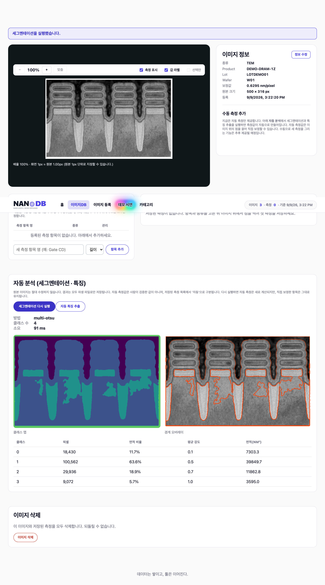

<p align="center">
  <picture>
    <source media="(prefers-color-scheme: dark)" srcset="assets/logo/nanodb_logo_horizontal_dark.png">
    
  </picture>
</p>

<p align="center">
  <strong>NANoDB: Nano Assets, Never orphaned Database.</strong><br>
  <sub>데이터는 쌓이고, 툴은 이어진다.</sub>
</p>

# NANoDB

NANoDB는 반도체 SEM/TEM 이미지와 측정 근거를 축적하고, 이를 AI 기반 분석 소프트웨어 개발에 필요한 컨텍스트와 검증 데이터로 재사용하는 경량 웹 애플리케이션입니다. 이름은 `Nano Assets, Never orphaned Database`에서 왔으며, 데이터와 맥락이 담당자나 도구의 변화 속에서도 흩어지지 않게 하는 것을 지향합니다.

> 현재 저장소에는 MVP 요구사항, AI-DLC 워크플로우, 로고와 검증된 샘플 데이터에 더해 NANoDB Core 웹 애플리케이션(FastAPI backend, React frontend, PostgreSQL 스키마·migration, demo·검증 tooling)과 계층별 테스트가 생성되어 있습니다. 2026-09-08 기준 Docker/PostgreSQL 환경에서 컨테이너 스택 기동과 전체 게이트(backend 98 passed·skip 없음, frontend 66 passed, Playwright e2e 7 passed, lint·typecheck·preflight)를 실행해 통과했습니다.

> **후속 개발자를 위한 문서** — 아키텍처·백엔드·프론트엔드·데이터 모델·API·컨텍스트 내보내기·
> 테스트/배포·확장 방법을 코드에 근거해 정리한 **[NANoDB 개발자 가이드](https://geniuskey.github.io/nanodb/guide/)** 가 있습니다.
> 로컬 개발 환경 설정은 [개발 환경 설정](https://geniuskey.github.io/nanodb/guide/getting-started.html) 문서를 먼저 보세요.

## 핵심 기능

1. **이미지 등록** — PNG·JPEG·TIFF를 제조 메타데이터(Product·Lot·Wafer와 선택 입력 공정 Step)·`nm/pixel` 보정값과 함께 등록합니다. TIFF는 원본을 보존하고 화면 표시용 PNG 파생본을 만듭니다.
2. **목록·검색** — 등록 이미지를 최신순 목록에서 키워드·종류(SEM/TEM)·Product로 찾아 다시 엽니다.
3. **자동 분석** — 세그멘테이션(multi-Otsu)과 자동 특징 추출로 폭·높이·간격·반경·측벽각 등을 길이·각도·곡률 측정값으로 자동 생성합니다. 사람이 검증하지 않은 **미검토 참고값**으로 신뢰도와 함께 '자동'으로 구분 저장합니다.
4. **보정·복원** — 자동 측정의 기준점을 이미지 위에서 직접 끌어 값을 재계산하고 라벨·메모를 편집합니다. 저장된 좌표·측정값은 새로고침 후에도 같은 위치에 overlay로 복원됩니다.
5. **집계** — 홈에서 실제 이미지 수·측정 수와 항목별 표본 수·평균·최소·최대를 확인합니다.
6. **개발 컨텍스트 내보내기** — 선택 이미지의 명세·측정·개발 과제·검증 정답을 담은 고정 네 파일 ZIP을 API로 내려받습니다(`GET /api/images/{id}/context-export`, `schema_version 3.1`).
7. **외부 AI 검증 데모** — 내보낸 컨텍스트로 외부 AI 개발 도구에서 요약 CSV 생성 코드를 만들고 오프라인으로 검증합니다. 앱 외부의 수동 개발 데모입니다.

> 측정값은 자동 세그멘테이션·특징 추출로 생성되는 **미검토 참고값**이며, 자동 계측의 정답(ground truth)으로 취급하지 않습니다. 수동 두 점 측정 UI는 코드에 남아 있으나 현재 비활성(`MANUAL_MEASUREMENT_ENABLED = false`)이고, 저장된 자동 측정의 기준점 보정만 제공합니다.

홈 최상단 소개 영상은 저장소에 포함된 로컬 파일(`assets/video/nanodb_intro.mp4`)을 재생합니다. 외부 임베드나 서드파티 스크립트를 쓰지 않으므로 **네트워크가 차단된 환경에서도 그대로 재생됩니다.** 영상은 보조 자료이므로 재생하지 않고 홈 내용만으로 진행해도 되며, 그 안내가 영상 아래에 항상 표시됩니다. 시스템에서 동작 줄이기(reduced motion)를 켠 환경에서는 자동 재생하지 않고 재생 버튼을 제공합니다.

자유 윤곽(폴리곤) 라벨링과 라벨 검수, Tool 등록, Lineage, Report는 이번 3일 MVP의 후속 로드맵입니다.

## 시연 화면

아래 화면은 로컬 PostgreSQL 16과 native uvicorn으로 앱을 실행한 뒤 승인된 demo 데이터로
Playwright가 자동 캡처한 실제 동작 화면입니다(캡처 시각 2026-09-09, commit
`46b7f3a`, 캡처 스크립트 [`scripts/capture_screenshots.mjs`](scripts/capture_screenshots.mjs)).
공개 배포된 서비스가 아니라 로컬 실행 결과이며, 비밀정보나 비공개 자료는 포함하지 않습니다.
홈 최상단의 소개 영상은 보조 자료이며 앱 기능 근거가 아닙니다(HOM-040).
캡처 스크립트는 `screenshots/`와 사이트용 사본 `docs/public/screenshots/`를 함께 갱신하므로
두 곳이 어긋나지 않습니다.

| 화면 | 대응 기능 |
| --- | --- |
|  | 홈에서 실제 이미지 수·측정 수·파라미터 집계와 사용 흐름 끝의 등록·목록 CTA (기능 5) |
|  | 등록된 이미지를 목록에서 최신순으로 찾아 다시 열기 (기능 2) |
|  | PNG/JPEG/TIFF를 제조 메타데이터·보정값과 함께 등록 (기능 1) |
|  | 세그멘테이션 실행 결과인 클래스 맵·경계 오버레이·클래스 통계 (기능 3) |
|  | 자동 특징 추출로 만든 측정값의 overlay 복원과 '자동(미검증)' 저장 목록 (기능 3, 4) |

캡처는 자동 세그멘테이션·특징 추출로 생성된 미검토 참고값을 자동 계측의 정답으로 표현하지 않습니다.

## 빠른 시작

사전 요구사항(Python 3.12·`uv`·Node 22.17.1·PostgreSQL 16·Docker), `.env` 변수,
네이티브·컨테이너 두 실행 경로, `make` 없이 실행(Windows PowerShell 대응표), 데모 데이터
준비·초기화, 자주 쓰는 Makefile 타깃은 모두 코드 기준으로
**[개발 환경 설정 가이드](https://geniuskey.github.io/nanodb/guide/getting-started.html)** 에
정리되어 있습니다. 최단 경로만 요약하면 다음과 같습니다.

```bash
git clone https://github.com/geniuskey/nanodb.git
cd nanodb
cp .env.example .env         # 필요 시 값 수정
make install && make build-frontend
make demo                    # 컨테이너 스택 + demo 데이터 (Docker 필요)
# 또는 네이티브: make migrate && make dev  (로컬 PostgreSQL 16 필요)
```

앱은 `http://127.0.0.1:8000`(loopback)에서 제공됩니다. Windows(PowerShell)·`make` 없는
환경·포트 충돌·alembic `DATABASE_URL` 주의·데모 시딩/초기화 가드 등 세부 사항은 위
가이드에 있습니다.

## 테스트

```bash
make test                   # backend(pytest) + frontend(vitest)
make test-e2e               # Playwright 브라우저 시나리오 (실행 중인 앱 대상)
make lint                   # ruff
make typecheck              # mypy + tsc
```

PostgreSQL 통합 테스트 가드(`TEST_DATABASE_URL`, 대상 DB 이름이 `_test`로 끝나야 함)와 e2e
대상 서버(`E2E_BASE_URL`, 기본 `http://127.0.0.1:8000`) 설정, e2e 실행 후 깨끗한 시연 상태로
되돌리는 방법은 **[테스트·빌드·배포 가이드](https://geniuskey.github.io/nanodb/guide/testing-and-ci.html)** 를
참고하세요.

## 컨텍스트 내보내기 (ZIP)

`GET /api/images/{id}/context-export`로 고정 네 파일 ZIP을 내려받습니다(API 전용 — 프런트엔드
다운로드 버튼은 없습니다).

- `context.md` — 좌표계·계산 규칙·데이터 주의사항
- `data.json` — 선택 이미지와 저장된 모든 측정. 각 측정은 자기 라벨(`label`)과 메모(`note`)를 함께 담습니다 (`schema_version` `3.1`)
- `task.md` — 수행할 개발 과제
- `checks.json` — 검증용 정답(ground truth)

이미지 바이너리·절대 경로·secret은 포함하지 않으며, 자동 외부 전송도 하지 않습니다. 상세 계약은
개발자 가이드의 [컨텍스트 내보내기](https://geniuskey.github.io/nanodb/guide/context-export.html)·[API 레퍼런스](https://geniuskey.github.io/nanodb/guide/api-reference.html)를
참고하세요.

## 외부 AI 생성 코드 검토·실행·검증

내보낸 컨텍스트로 외부 AI 개발 도구에서 요약 CSV 생성 코드를 만들고 오프라인으로 검증하는
자산이 [`validation/external-ai/`](validation/external-ai/)에 있습니다. 수동 설명 준비와
컨텍스트 내보내기 두 방식을 같은 과제로 비교하며, 준비 시간·추가 요청 수·검증 결과를
`pass`/`fail`/`unverified` 그대로 기록합니다. 이 도구는 앱 런타임에 연결되지 않고 모델을
자동 호출하지 않습니다. 향상이나 토큰 절감을 미리 주장하지 않습니다.

2026-09-08 기준 두 arm을 실제로 실행해 기록했습니다. 같은 이미지(id 1)·같은 과제이며,
실행에 사용한 export는 [`validation/external-ai/exports/2026-09-08-image-1/`](validation/external-ai/exports/2026-09-08-image-1/)에
보존해 앱 없이도 재현됩니다.

| Run | Arm | 검증 | 판정 |
| --- | --- | ---: | --- |
| [`2026-09-08-context-1`](validation/external-ai/results/run-2026-09-08-context-1.md) | context | 3/3 | `pass` |
| [`2026-09-08-manual-1`](validation/external-ai/results/run-2026-09-08-manual-1.md) | manual | 2/3 | `fail` |

manual arm의 실패 원인은 생성 코드의 버그가 아니라 이중 반올림입니다. 화면은 `value_nm`을
소수점 두 자리로 표시하므로(`toFixed(2)`) 사람이 옮겨 적은 값의 평균이 저장 정밀도 평균의
반올림과 어긋날 수 있습니다. 여기서는 Thickness가 `11.18`로 나와 기대값 `11.17`과 달랐고,
CD·Depth는 같은 전사에도 우연히 일치했습니다.

이 결과는 손으로 옮겨 적는 방식에 실재하는 실패 양상을 보여줄 뿐, 수작업 설명이 일반적으로
더 나쁘다는 근거가 아닙니다. 또한 **준비 시간은 `unmeasured`입니다**. 두 arm 모두 사람이
시간을 재며 수행하지 않았고 같은 모델이 한 세션에서 실행했으므로, 독립적인 A/B 시험이
아닙니다. EVL-006이 요구하는 준비 시간 비교는 사람이 직접 수행하는 run이 따로 필요합니다.

## 알려진 제한

- 인증·권한은 이번 범위 밖입니다.
- 측정값은 자동 세그멘테이션(multi-Otsu)·특징 추출로 생성되는 **미검토 참고값**이며, 자동 계측의 정답(ground truth)으로 취급하지 않습니다. 수동 두 점 측정 UI는 코드에 남아 있으나 현재 비활성(`MANUAL_MEASUREMENT_ENABLED = false`)이고, 저장된 자동 측정의 기준점 보정만 제공합니다.
- 저장된 측정은 라벨·메모와 자동 측정 기준점 보정 외에는 수정할 수 없습니다. 항목·값·보정값은 측정 근거이므로 불변이며, 잘못된 측정은 삭제 후 다시 분석합니다.
- 태블릿·모바일 터치 조작과 다크모드는 지원 범위가 아닙니다.
- 앱은 단일 호스트 로컬 파일 저장을 사용하며 multi-instance·객체 저장소·HA는 범위 밖입니다.
- 앱 내부 AI 호출·코드 실행 기능은 없습니다.
- 배포·아키텍처·API 상세는 개발자 가이드의 [테스트·빌드·배포](https://geniuskey.github.io/nanodb/guide/testing-and-ci.html)·[아키텍처](https://geniuskey.github.io/nanodb/guide/architecture.html)·[API 레퍼런스](https://geniuskey.github.io/nanodb/guide/api-reference.html)를 참고하세요.

## 샘플 데이터

| 데이터 묶음 | 수량 | 내용 | Manifest |
| --- | ---: | --- | --- |
| TEM | 12 | DRAM, Flash, Logic TEM 샘플과 TIFF private tag | [`data/samples/tem/metadata.csv`](data/samples/tem/metadata.csv) |
| Layout | 2 | 4T APS 센서 레이아웃, 1T1C DRAM 레이아웃 | [`data/samples/layout/metadata.csv`](data/samples/layout/metadata.csv) |

각 manifest에는 안정적인 sample ID, 파일명, SHA-256, 도메인 메타데이터와 프로젝트 사용 승인 상태가 들어 있습니다. TIFF 파일은 일반 Git 바이너리로 함께 관리합니다.

샘플 TIFF는 원본 데이터와 메타데이터 처리 검증용입니다. 브라우저 직접 등록 형식은 PNG/JPEG/TIFF이며, TIFF를 올리면 앱이 원본을 보존한 채 원본 픽셀 크기를 유지한 PNG 파생본을 만들어 화면에 표시합니다(리샘플링하지 않으므로 저장 좌표가 1:1로 맞습니다). 데모 사전 준비 단계에서 PNG 파생본을 미리 만들어 두는 절차도 그대로 유지하며, 리샘플링하지 않은 경우에만 manifest의 `length_nm_per_pixel`을 그대로 사용합니다. 파생본 준비·무결성 점검·데모 초기화(`make prepare-demo`, `make preflight`, `make seed-demo`, `make reset`) 절차는 [개발 환경 설정 가이드의 데모 데이터 절](https://geniuskey.github.io/nanodb/guide/getting-started.html#데모-데이터)에 정리되어 있습니다.

### 샘플 검증

의존성 설치(`make install`) 후 `uv`로 실행합니다.

```bash
uv run python scripts/verify_tem_samples.py
uv run python scripts/verify_layout_samples.py
```

검증기는 다음 항목을 확인합니다.

- Manifest에 기록된 파일의 누락 또는 초과
- SHA-256 파일 무결성
- 이미지 크기, 색상 모드와 압축 형식
- TEM TIFF private tag와 manifest 값의 일치

### TEM 메타데이터 읽기

```bash
uv run python scripts/tem_metadata.py data/samples/tem/images/tem_001.tif
```

`write_meta()`는 원본을 덮어쓰지 않고 별도 파생 TIFF만 생성합니다. `scrap_step`은 현재 숫자형 문자열과 코드형 문자열이 혼재하므로 도메인 정의가 확정될 때까지 문자열로 취급합니다.

## 저장소 구조

```text
nanodb/
├── src/
│   ├── backend/nanodb/          # FastAPI app, domain, services, persistence, adapters
│   └── frontend/                # React 19 + Vite frontend
├── alembic/                     # PostgreSQL migration 환경과 revision
├── tests/                       # backend(unit/api/contract/integration)와 e2e
├── scripts/                     # 샘플 검증·demo 준비/preflight/reset tooling
├── validation/external-ai/      # 외부 AI 생성 코드 검증 자산 (US-07)
├── data/
│   ├── samples/                 # 원본 TEM·layout 샘플과 manifest (앱에 mount 안 함)
│   └── demo/                    # 무리샘플 PNG 파생본과 manifest
├── assets/logo/                 # 라이트·다크 로고
├── requirements/                # 3일 MVP 요구사항
├── references/                  # 로고·홈 탭 기준 PDF
├── aidlc-docs/                  # AI-DLC 상태와 산출물
├── Dockerfile, compose.yaml     # 단일 이미지 build와 db→migrate→app 스택
├── Makefile, .env.example       # task 진입점과 환경 예시
├── AGENTS.md                    # Codex용 AI-DLC 지침
└── CLAUDE.md                    # Claude Code용 AI-DLC 지침
```

런타임 업로드(`var/uploads/`)와 built frontend(`dist/`)는 생성물이며 Git에 커밋하지
않습니다.

## 평가 근거 사이트 (Evidence Site)

해커톤 평가자를 위한 정적 근거 사이트가 `docs/`에 VitePress로 있습니다. 문제·실제 기능·
AI-DLC 근거·검증 상태·한계를 소개·근거 두 페이지에서 확인합니다. Core runtime과 분리된
독립 dependency 그래프(`docs/package.json`, `docs/package-lock.json`)를 사용하며 실행 중
Core 앱과 통신하지 않습니다.

```bash
cd docs
npm ci                      # docs/package-lock.json 고정 설치
npm run docs:dev            # 로컬 개발 서버
npm run docs:build          # 정적 build → docs/.vitepress/dist
npm run docs:preview        # build 결과 미리보기 (배포와 동일 base /nanodb/)
```

Node 버전은 루트 `.nvmrc`(22.17.1)로 로컬·CI를 일치시킵니다.

### GitHub Pages 배포 (관리자 설정)

1. 저장소 **Settings → Pages → Build and deployment → Source**를 **GitHub Actions**로
   설정합니다.
2. `main`에 `docs/**`·`screenshots/**`·`.nvmrc`·배포 workflow가 push되면
   [`.github/workflows/deploy-evidence-site.yml`](.github/workflows/deploy-evidence-site.yml)이
   사이트를 build하고 **build 성공 후에만** Pages에 배포합니다. 수동 실행은 Actions 탭의
   `workflow_dispatch`로 합니다.
3. 배포는 최소 권한(`contents: read`, `pages: write`, `id-token: write`)과 단일 배포
   concurrency(진행 중 배포 미취소)로 제한됩니다.

> 1번 관리자 설정은 이미 완료돼 있습니다. `main` push마다 build·deploy job이 실행되어
> 성공하고 있으므로 추가 설정 없이 게시됩니다. 실행 이력은 저장소 Actions 탭의
> `Deploy evidence site`에서 확인할 수 있습니다.

### 게시 안전 원칙

- 공개 사이트는 localhost 앱으로 연결하지 않습니다.
- 원본 이미지·비밀정보·내부 audit 원문·비공개 자료를 게시하지 않습니다.
- 시연 스크린샷은 승인된 demo 데이터만 사용하며, 캡처 버전·시각을 표기합니다.
- 사이트가 참조하는 스크린샷은 자체 포함을 위해 `docs/public/screenshots/`에 동일 사본을
  두며, 원본 캡처는 루트 `screenshots/`입니다.

## 요구사항 문서

- [NANoDB 3일 MVP 요구사항](requirements/nanodb-mvp-requirements.md)
- [홈 탭 요구사항](requirements/home-tab-requirements.md)
- [의도적 제외사항](requirements/constraints.md)
- [AI-DLC 통합 요구사항](aidlc-docs/inception/requirements/requirements.md)

## 데이터 관리 원칙

- 원본 이미지는 직접 수정하지 않습니다.
- 측정과 수정 실험 결과는 원본과 분리된 파생 데이터로 저장합니다.
- 이미지 교체 시 manifest의 SHA-256과 메타데이터를 함께 갱신합니다.
- 런타임 업로드, PostgreSQL 연결 비밀값, 생성 결과는 Git에 커밋하지 않습니다.
- 홈에는 실제 데이터 집계값만 표시하고 예시 KPI를 대입하지 않습니다.

## 대회와 팀 목표

5명이 3일 동안 각자 소속 팀에 필요한 도구를 독립 개발합니다. NANoDB는 그중 한 프로젝트이며 담당자가 앱·데이터·검증·사용법을 책임집니다. 공통 발표에는 현업 문제, AI 개발에서 돕는 작업, 실제 전후 비교, 대회 이후 활용 업무를 담습니다.

NANoDB는 AI로 분석 코드를 만들 때 반복하는 데이터 형식·좌표계·단위 설명을 재사용 가능한 컨텍스트로 제공합니다. 자료 준비 시간, 추가 설명·수정 요청 수와 검증 통과 여부를 실제로 비교할 계획이며, 향상이나 토큰 절감을 미리 주장하지 않습니다. 앱·내보내기는 오프라인 동작을 목표로 하며 앱에 모델 호출·코드 실행 기능을 넣지 않습니다.

## 개발 워크플로우

이 저장소에는 AWS Labs AI-DLC v1.0.1 워크플로우가 설치되어 있습니다.

- Codex: `AGENTS.md`, `.agents/skills/aidlc/`
- Claude Code: `CLAUDE.md`, `.aidlc-rule-details/`
- 진행 상태: `aidlc-docs/aidlc-state.md`

## 프로젝트 상태

- [x] 3일 MVP 범위 정의
- [x] 홈 탭 요구사항 정리
- [x] 라이트·다크 로고 준비
- [x] TEM/Layout 샘플과 manifest 검증
- [x] 웹 애플리케이션 구현 (backend·frontend·PostgreSQL·계층별 테스트 생성)
- [x] 대회 취지에 맞춘 개발 컨텍스트·AI 코드 검증 요구사항 반영
- [x] 개발 컨텍스트 ZIP 구현
- [x] demo 준비·검증 tooling과 배포 artifact 생성
- [x] 외부 AI 생성 코드 검증 자산 생성
- [x] Build and Test: 전체 게이트 통과 (backend 98 passed·skip 없음, frontend 66 passed, e2e 7 passed, lint·typecheck·preflight green, 2026-09-08)
- [x] Docker/PostgreSQL 환경에서 integration·브라우저 e2e·컨테이너 스택 최종 통과 판정
- [x] 외부 AI 개발 데모 2개 arm 실행·기록 (context `pass` 3/3, manual `fail` 2/3)
- [ ] 설명 준비 시간 비교는 사람이 직접 수행하는 run이 필요 (현재 `unmeasured`)

## License

프로젝트 전체의 오픈소스 라이선스는 아직 지정되지 않았습니다. 샘플 데이터의 `PROJECT_AUTHORIZED` 표시는 이 저장소에서의 사용 승인을 뜻하며 별도의 SPDX 라이선스 선언은 아닙니다.
