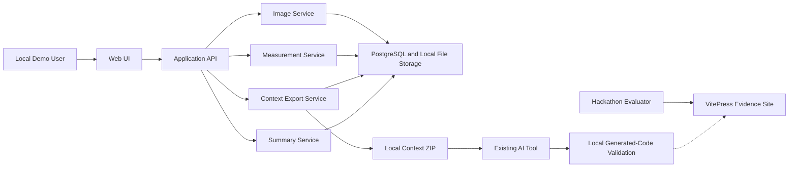

# Component Diagram

## Text Alternative

- 로컬 사용자는 Web UI와 Application API를 통해 Image, Measurement, Summary와 Context Export 서비스를 사용한다.
- 서비스는 PostgreSQL과 단일 앱 호스트의 로컬 파일 저장소를 사용한다.
- Context Export Service는 로컬 ZIP을 만들며, 사용자가 외부 AI 도구와 로컬 검증에 수동으로 사용한다.
- 검증 결과는 런타임과 분리된 VitePress Evidence Site에 반영된다.
