# NANoDB 해커톤 실행 계획

## 계획 체크리스트

- [x] 승인된 요구사항, 페르소나와 사용자 이야기를 불러왔다.
- [x] 사용자·구조·데이터·API·비기능 영향과 위험을 평가했다.
- [x] 실행·생략 단계를 결정했다.
- [x] 3일 해커톤 순서와 성공 기준을 정리했다.
- [x] Mermaid 문법과 텍스트 대안을 검증했다.
- [x] 상태와 감사 기록을 갱신했다.

## 분석 요약

- **유형**: Greenfield 로컬 웹 앱과 최소 평가 사이트
- **사용자 영향**: 홈, 이미지 등록·조회, 두 점 측정·복원, 컨텍스트 내보내기와 평가 자료가 새로 생긴다.
- **구조 영향**: 브라우저 UI, 서버, PostgreSQL, 로컬 파일 저장소, ZIP 생성과 VitePress가 필요하다.
- **데이터 영향**: Image와 Measurement 스키마, 원본 좌표·보정값·시각·정밀도 규칙이 필요하다.
- **API 영향**: 이미지, 측정, 요약과 컨텍스트 내보내기를 위한 내부 인터페이스가 필요하다.
- **NFR 영향**: 업로드 제한, 서버 재계산, 로컬 지속성, 2초 목표와 공개 자료 경계가 있다.
- **위험 수준**: 중간 — 좌표 복원과 ZIP 계약 오류는 데모 실패로 이어지지만 Greenfield라 되돌리기는 쉽다.
- **테스트 복잡도**: 보통 — 정상 흐름 외에 좌표·재시작·파일 검증과 ZIP 내용 검사가 필요하다.

## 작업 단위 방향

Units Generation에서 최종 확정하되 다음 두 단위로 시작한다.

1. **NANoDB Core**: US-01~US-07의 데모 데이터, 앱, 저장소, 측정과 컨텍스트 내보내기.
2. **Evidence Site**: US-08의 VitePress 소개·근거 페이지와 Pages workflow.

Evidence Site의 최종 근거는 NANoDB Core의 실제 검증 결과에 의존한다.

## Workflow Visualization

```mermaid
flowchart TD
    Start(["Approved MVP"])
    subgraph INCEPTION["INCEPTION"]
        WD["Workspace Detection<br/><b>COMPLETED</b>"]
        RE["Reverse Engineering<br/><b>SKIPPED</b>"]
        RA["Requirements Analysis<br/><b>COMPLETED</b>"]
        US["User Stories<br/><b>COMPLETED</b>"]
        WP["Workflow Planning<br/><b>REVIEW</b>"]
        AD["Application Design<br/><b>COMPLETED</b>"]
        UG["Units Generation<br/><b>PLANNING</b>"]
    end
    subgraph CONSTRUCTION["CONSTRUCTION"]
        FD["Functional Design<br/><b>EXECUTE</b>"]
        NFRA["NFR Requirements<br/><b>EXECUTE</b>"]
        NFRD["NFR Design<br/><b>EXECUTE</b>"]
        ID["Infrastructure Design<br/><b>EXECUTE</b>"]
        CG["Code Generation<br/><b>EXECUTE</b>"]
        BT["Build and Test<br/><b>EXECUTE</b>"]
    end
    subgraph OPERATIONS["OPERATIONS"]
        OPS["Operations<br/><b>PLACEHOLDER</b>"]
    end
    Start --> WD
    WD --> RE
    RE --> RA
    RA --> US
    US --> WP
    WP --> AD
    AD --> UG
    UG --> FD
    FD --> NFRA
    NFRA --> NFRD
    NFRD --> ID
    ID --> CG
    CG --> BT
    BT --> End(["Complete"])
    BT -.-> OPS

    style WD fill:#4CAF50,stroke:#1B5E20,stroke-width:3px,color:#fff
    style RE fill:#BDBDBD,stroke:#424242,stroke-width:2px,stroke-dasharray:5 5,color:#000
    style RA fill:#4CAF50,stroke:#1B5E20,stroke-width:3px,color:#fff
    style US fill:#4CAF50,stroke:#1B5E20,stroke-width:3px,color:#fff
    style WP fill:#4CAF50,stroke:#1B5E20,stroke-width:3px,color:#fff
    style AD fill:#FFA726,stroke:#E65100,stroke-width:3px,stroke-dasharray:5 5,color:#000
    style UG fill:#FFA726,stroke:#E65100,stroke-width:3px,stroke-dasharray:5 5,color:#000
    style FD fill:#FFA726,stroke:#E65100,stroke-width:3px,stroke-dasharray:5 5,color:#000
    style NFRA fill:#FFA726,stroke:#E65100,stroke-width:3px,stroke-dasharray:5 5,color:#000
    style NFRD fill:#FFA726,stroke:#E65100,stroke-width:3px,stroke-dasharray:5 5,color:#000
    style ID fill:#FFA726,stroke:#E65100,stroke-width:3px,stroke-dasharray:5 5,color:#000
    style CG fill:#4CAF50,stroke:#1B5E20,stroke-width:3px,color:#fff
    style BT fill:#4CAF50,stroke:#1B5E20,stroke-width:3px,color:#fff
    style OPS fill:#BDBDBD,stroke:#424242,stroke-width:2px,stroke-dasharray:5 5,color:#000
    style Start fill:#CE93D8,stroke:#6A1B9A,stroke-width:3px,color:#000
    style End fill:#CE93D8,stroke:#6A1B9A,stroke-width:3px,color:#000
    style INCEPTION fill:#BBDEFB,stroke:#1565C0,stroke-width:3px,color:#000
    style CONSTRUCTION fill:#C8E6C9,stroke:#1B5E20,stroke-width:3px,color:#000
    style OPERATIONS fill:#FFF59D,stroke:#F57F17,stroke-width:3px,color:#000
    linkStyle default stroke:#333,stroke-width:2px
```

### Text Alternative

1. 완료: Workspace Detection → Requirements Analysis → User Stories → Workflow Planning 문서 생성
2. 생략: Reverse Engineering — 구현 전 Greenfield 프로젝트
3. 다음: Application Design → Units Generation
4. 단위별: 필요한 Functional/NFR/Infrastructure Design → Code Generation
5. 전체: Build and Test
6. Operations: 현재 AI-DLC에서는 placeholder

## 실행할 단계

### INCEPTION

- [x] Workspace Detection — 완료
- [x] Reverse Engineering — Greenfield라 생략 완료
- [x] Requirements Analysis — 승인 완료
- [x] User Stories — 승인 완료
- [x] Workflow Planning — 계획 작성 완료, 검토 대기
- [x] Application Design — 새 UI·서버·저장소·ZIP 경계를 최소 깊이로 정의
- [x] Units Generation — 새 스키마와 내부 API, 앱·평가 사이트의 의존 순서를 두 단위로 확정

### CONSTRUCTION

- [x] Functional Design — NANoDB Core의 좌표 계산, 저장·복원과 ZIP 규칙만 상세화
- [x] NFR Requirements — 기술 스택, 로컬 성능·입력 제한·재현성 기준을 확정
- [x] NFR Design — 위 기준을 서버 검증, 저장 방식과 테스트 경계에 반영
- [x] Infrastructure Design — 로컬 PostgreSQL 실행·파일 경로와 GitHub Pages workflow를 정의
- [ ] Code Generation — 각 단위의 계획 승인 후 구현과 테스트 생성
- [ ] Build and Test — 전체 빌드, 단위·통합·계약·문서 검증

### OPERATIONS

- [ ] Operations — placeholder이므로 이번 해커톤에서는 실행하지 않음

## 3일 순서

- **1일차**: 최소 설계 → NANoDB Core의 등록·목록·측정·복원
- **2일차**: 컨텍스트 ZIP → 계약 테스트 → 외부 AI 개발 검증
- **3일차**: 전체 검증 → VitePress 근거 반영 → 빌드·리허설

P0 계측 기반이 통과하기 전에는 컨텍스트 내보내기로 넘어가지 않고, 두 P0 게이트가 통과하기 전에는 P1을 시작하지 않는다.

## 성공 기준

- 이미지 등록부터 측정 저장·복원이 깨끗한 로컬 환경과 서버 재시작 후 동작한다.
- 좌표·거리·보정값 계산과 ZIP 네 파일 계약이 자동 검증된다.
- 외부 AI 생성 코드를 실제 실행하고 결과 또는 실패 상태를 보존한다.
- VitePress build가 성공하고 평가자가 실제 기능과 한계를 구분할 수 있다.
- 요구사항 → 이야기 → 설계 → 코드 → 검증 근거를 추적할 수 있다.

## 확장 규칙 적용 상태

- **Resiliency Baseline**: N/A — 비활성화됨.
- **Security Baseline**: N/A — 비활성화됨. 승인된 일반 입력·공개 경계 검증은 유지한다.
- **Property-Based Testing**: N/A — 비활성화됨.
