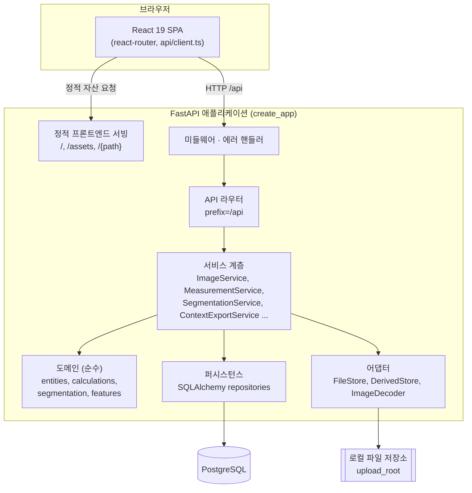
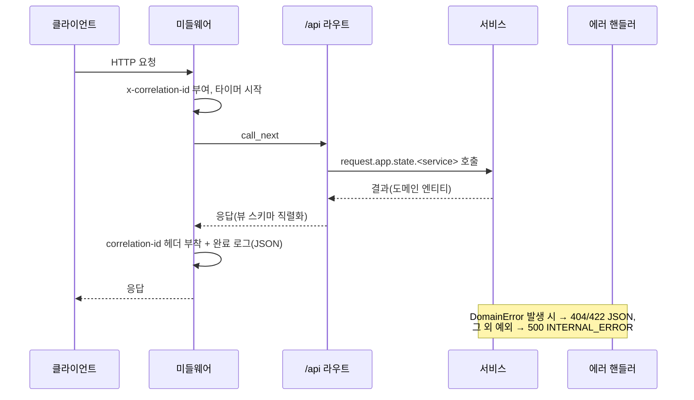

# 아키텍처

이 문서는 NANoDB를 처음 인수받는 엔지니어가 "시스템이 어떤 모양이고, 요청이 어디를 거쳐 흐르는가"를 빠르게 파악하도록 정리한 것입니다. 모든 설명은 실제 코드(`src/backend/nanodb/`, `src/frontend/src/`)에 근거하며, 세부 구현은 [백엔드](/guide/backend) · [프론트엔드](/guide/frontend) · [데이터 모델](/guide/data-model) 페이지에서 더 깊이 다룹니다.

## 1. 시스템 개요

브라우저에서 동작하는 React SPA가 하나의 FastAPI 애플리케이션과 `/api` 경로로만 통신합니다. FastAPI는 두 가지 역할을 겸합니다. (1) `/api/*` 아래의 JSON/파일 API, (2) 빌드된 프론트엔드 정적 파일 서빙. 서비스 계층 아래로 도메인(순수 로직) · 퍼시스턴스(PostgreSQL) · 어댑터(파일 저장, 이미지 디코딩)가 놓입니다.



::: details Mermaid가 렌더되지 않을 때 (ASCII 대안)
```
[브라우저: React SPA]
     |  (a) HTTP /api/*        (b) 정적 자산 /, /assets
     v                              v
+------------------------------------------------+
|  FastAPI 애플리케이션 (create_app)              |
|  미들웨어 -> 에러핸들러 -> /api 라우터           |
|                     |                          |
|                     v                          |
|              [서비스 계층]                      |
|            /       |        \                   |
|           v        v         v                  |
|     [도메인]  [퍼시스턴스]  [어댑터]             |
|      (순수)      |            |                 |
+-----------------|------------|-----------------+
                  v            v
             [PostgreSQL]  [로컬 파일 저장소]
```
:::

> [!NOTE]
> 프론트엔드 서빙은 선택적이며 파일 존재 여부로 결정됩니다. `_install_frontend`(`src/backend/nanodb/api/app.py:80`)는 `settings.frontend_dist`(기본값 `dist/frontend`) 아래에 `index.html`이 있으면 SPA 라우팅용 catch-all 라우트를 등록하고, `assets/` 디렉터리가 있으면 `/assets`에 마운트합니다. 개발 중에는 Vite dev 서버가 프론트엔드를 서빙하므로 이 파일들이 없어도 API는 정상 동작합니다.

## 2. 백엔드 계층 구조와 의존성 방향

의존성은 항상 바깥(프레임워크)에서 안(순수 도메인)으로 흐릅니다. 도메인은 아무 것에도 의존하지 않고, 서비스가 퍼시스턴스와 어댑터를 주입받아 조립합니다.

```
api  ->  services  ->  domain (순수)
                  ->  persistence (SQLAlchemy)
                  ->  adapters (파일/이미지)
```

| 계층 | 위치 | 책임 | 의존 방향 |
| --- | --- | --- | --- |
| API | `nanodb/api/` | HTTP 라우팅, 요청/응답 스키마 검증, 도메인 예외 → JSON 매핑 | 서비스만 호출 |
| 서비스 | `nanodb/services/` | 유스케이스 오케스트레이션(트랜잭션 경계, 파일+DB 조율) | 도메인 · 퍼시스턴스 · 어댑터 사용 |
| 도메인 | `nanodb/domain/` | 엔티티, 측정 계산, 세그멘테이션·피처 규칙, `DomainError` | 의존 없음(프레임워크 없음) |
| 퍼시스턴스 | `nanodb/persistence/` | SQLAlchemy 엔진/세션, ORM 모델, 리포지토리 | 도메인 엔티티 사용 |
| 어댑터 | `nanodb/adapters/` | 로컬 파일 저장(`FileStore`/`DerivedStore`), 이미지 디코딩(`ImageDecoder`) | 도메인 `DomainError`만 참조 |

핵심 규칙: **도메인 계층은 FastAPI · SQLAlchemy 등 어떤 프레임워크에도 의존하지 않습니다.** 예컨대 `nanodb/domain/errors.py`의 `DomainError`는 순수 `ValueError` 서브클래스이며, HTTP 상태 코드는 여기서 결정하지 않고 API 계층(`errors.py`)에서 매핑합니다. 계층별 세부 구현은 [백엔드](/guide/backend), 엔티티/스키마는 [데이터 모델](/guide/data-model)을 참고하세요.

## 3. 요청 수명주기

애플리케이션은 팩토리 함수 `create_app`(`src/backend/nanodb/api/app.py:29`)에서 조립됩니다. 여기서 엔진·세션 팩토리·파일 저장소가 만들어지고, 각 서비스가 이들을 주입받아 `app.state`에 올라갑니다. 라우트 핸들러는 `request.app.state.<service>`로 이미 조립된 서비스를 꺼내 씁니다(별도 DI 프레임워크 없음).



조립·처리 순서:

- **부팅 시 조립** — `create_session_factory`(`persistence/database.py:14`)가 `pool_pre_ping`과 풀 설정으로 엔진을 만들고 `sessionmaker`를 반환합니다. `FileStore`/`DerivedStore`는 `settings.upload_root`를 루트로 생성됩니다. 이후 `ImageService`, `MeasurementService`, `SegmentationService`, `FeatureExtractionService`, `SegmentationBatchService`, `CatalogService`, `MeasurementItemService`, `SummaryService`, `ContextExportService`가 세션 팩토리·저장소를 주입받아 `app.state`에 등록됩니다.
- **미들웨어** — `install_request_middleware`(`api/middleware.py:17`)가 모든 요청에 `x-correlation-id`(없으면 새로 생성)를 부여하고 `request.state`에 저장한 뒤, 응답 헤더에 되돌려주고 `method`/`route`/`status`/`duration_ms`를 한정된 필드로 JSON 로깅합니다.
- **에러 처리** — `install_error_handlers`(`api/errors.py:16`)가 두 핸들러를 등록합니다. `DomainError`는 명시 `status`가 있으면 그것을, 없으면 코드가 `*_NOT_FOUND`면 404, 나머지는 422로 매핑해 `ErrorEnvelope`(code/message/detail) JSON을 돌려줍니다. 그 외 모든 예외는 correlation id와 함께 로깅한 뒤 내부 구현을 노출하지 않는 500 `INTERNAL_ERROR`로 감쌉니다.
- **트랜잭션 경계** — 서비스가 세션을 열고 성공 시 `commit`, 실패 시 `rollback`합니다(`persistence/database.py`의 `session_scope` 패턴). 파일과 DB를 함께 다루는 흐름은 아래 데이터 흐름 참고.

## 4. 데이터 흐름 (end-to-end)

이미지 등록부터 컨텍스트 내보내기까지의 대표 경로입니다. 파일 저장과 DB 기록을 어떻게 조율하는지가 핵심입니다.

```
[1] 이미지 등록  POST /api/images (multipart)
      ImageService.register:
        - FileStore.write_temporary()로 스테이징에 먼저 기록
        - ImageDecoder.inspect()로 크기/확장자 판별
        - 브라우저에서 못 여는 포맷(TIFF 등)은 PNG 미리보기 파생본 생성
        - ImageRepository.create()로 DB row 생성 + CatalogRepository.ensure_many()
        - commit 후에야 FileStore.promote()로 최종 위치로 원자적 이동
        - 실패 시 rollback + 스테이징/최종 파일 정리 (고아 방지)

[2] 측정 계산·저장  POST /api/images/{id}/measurements
      MeasurementService.create:
        - 도메인 계산(domain/calculations)으로 points → value 산출
        - MeasurementRepository로 저장

[3] (선택) 세그멘테이션 / 피처 추출
      SegmentationService.run → DerivedStore에 파생 산출물 저장
      FeatureExtractionService.run → 세그멘테이션 결과 기반 피처

[4] 컨텍스트 내보내기  GET /api/images/{id}/context-export
      ContextExportService.build:
        - 이미지 + 측정 조회 → ExportSnapshot 구성
        - validate_export_snapshot()로 도메인 검증
        - build_context_zip()이 context.md/data.json/task.md/checks.json을
          결정적(deterministic) ZIP으로 묶어 bytes 반환
        → application/zip 첨부 응답
```

> [!TIP]
> 등록 흐름의 순서(스테이징 → 커밋 → promote)는 의도적입니다. DB row가 커밋된 뒤에만 파일을 최종 위치로 옮기므로, 중간 실패는 "row 없는 고아 파일"이라는 복구 가능한 상태로만 남습니다. 삭제도 대칭적으로 row를 먼저 지우고 파일을 나중에 지웁니다(`image_service.py`의 `delete`).

내보내기 산출물의 정확한 구조와 스키마 버전은 [컨텍스트 내보내기](/guide/context-export)에서 다룹니다.

## 5. 프론트엔드 개요

프론트엔드는 Vite로 빌드되는 React 19 + TypeScript SPA입니다. 진입점은 `src/frontend/src/main.tsx`이며 `BrowserRouter`로 감싼 `<App />`을 렌더합니다. 라우팅은 `src/frontend/src/App.tsx`의 `react-router-dom`이 담당하고, 공통 셸(`Shell`) 아래에 페이지들이 놓입니다.

- **페이지** — 홈, 이미지DB 목록, 이미지 등록, 데모 시연, 카테고리, 측정(이미지 상세) 등이 라우트로 정의됩니다.
- **API 통신** — 모든 서버 호출은 `src/frontend/src/api/client.ts`의 `api` 객체를 통해 `/api/*`로 나갑니다. 오류 응답은 `ApiErrorEnvelope`(code/message/detail)를 파싱해 `ApiError`로 던지며, 파싱 실패 시 서버 내부를 노출하지 않는 한정된 기본 메시지로 대체합니다. 이는 백엔드 `ErrorEnvelope`와 대칭 구조입니다.
- **정적 서빙과의 관계** — 프로덕션에서 빌드 결과물을 `frontend_dist`에 놓으면 FastAPI가 직접 서빙하고, SPA 클라이언트 라우팅을 위해 알 수 없는 경로는 `index.html`로 폴백합니다.

자세한 컴포넌트 구조와 상태 관리는 [프론트엔드](/guide/frontend)를 참고하세요.

## 6. 기술 선택 근거

| 선택 | 이유 |
| --- | --- |
| FastAPI | 타입 힌트 기반 검증(Pydantic 스키마)과 자동 OpenAPI, 미들웨어/예외 핸들러 훅이 명확해 얇은 API 계층을 유지하기 쉬움 |
| SQLAlchemy + Alembic | 동기 세션으로 트랜잭션 경계를 명시적으로 다루고, Alembic으로 스키마 변경 이력을 마이그레이션으로 관리 |
| 헥사고날 지향 계층화 | 도메인을 프레임워크에서 분리해 계산·규칙을 순수하게 테스트하고, 저장소·파일·디코더를 어댑터로 교체 가능하게 유지 |
| 로컬 파일 저장 + DB 분리 | 원본 이미지는 파일 저장소, 메타데이터·측정은 DB에 두어 대용량 바이너리와 관계형 데이터의 책임을 분리 (스테이징→promote로 정합성 확보) |
| Vite + React 19 + TS | 빠른 개발 서버·번들, 타입 안전한 API 클라이언트, 그리고 정적 산출물을 FastAPI가 그대로 서빙 가능 |

관련 문서: [개요](/guide/) · [개발 환경](/guide/getting-started) · [백엔드](/guide/backend) · [프론트엔드](/guide/frontend) · [데이터 모델](/guide/data-model) · [API](/guide/api-reference) · [컨텍스트 내보내기](/guide/context-export) · [테스트·빌드·배포](/guide/testing-and-ci) · [용어집](/guide/glossary) · [확장·기여](/guide/contributing)
