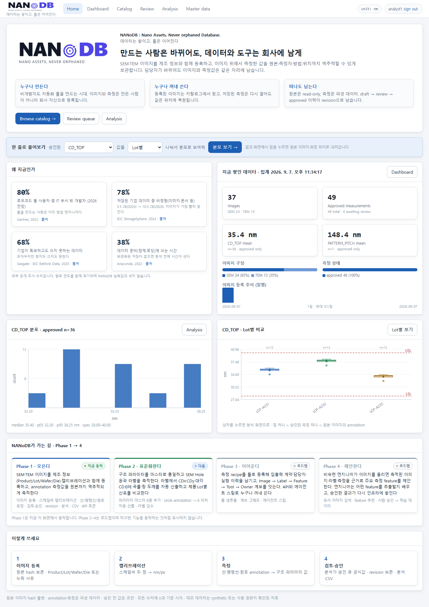
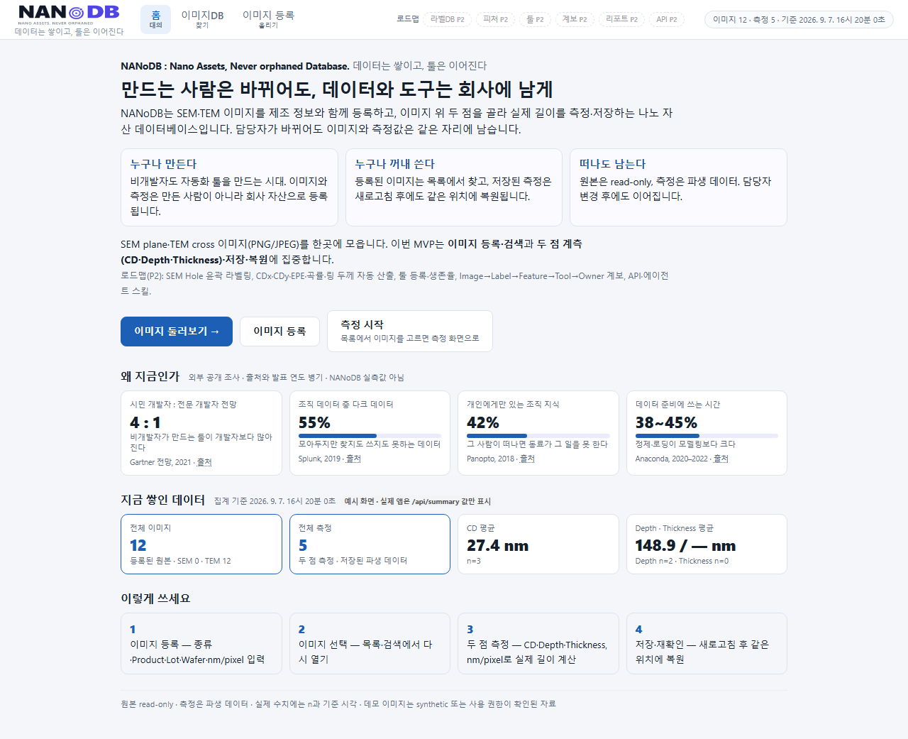
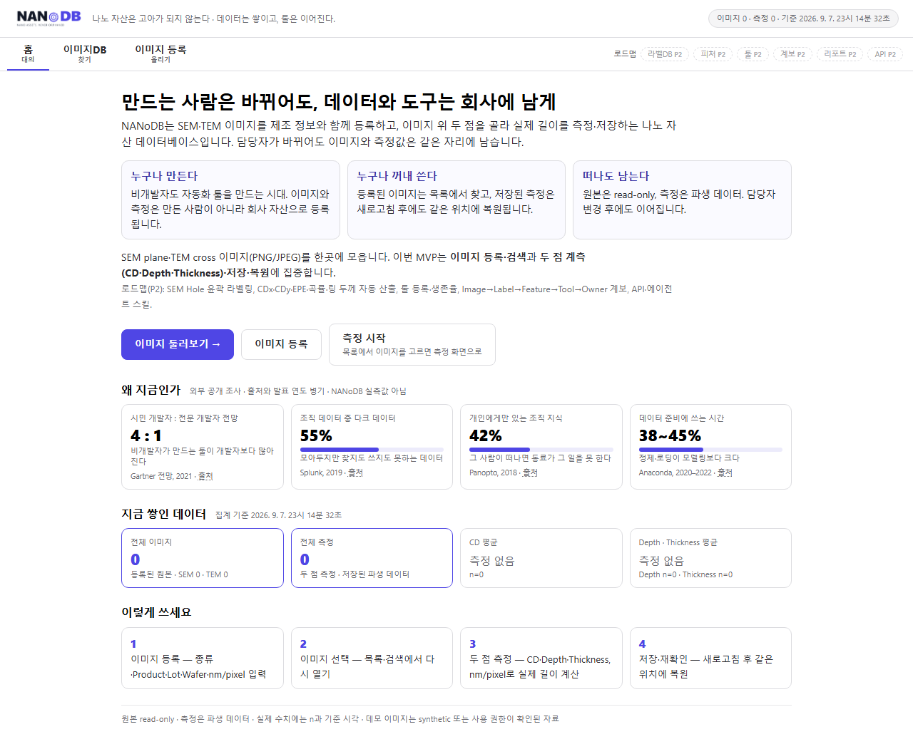
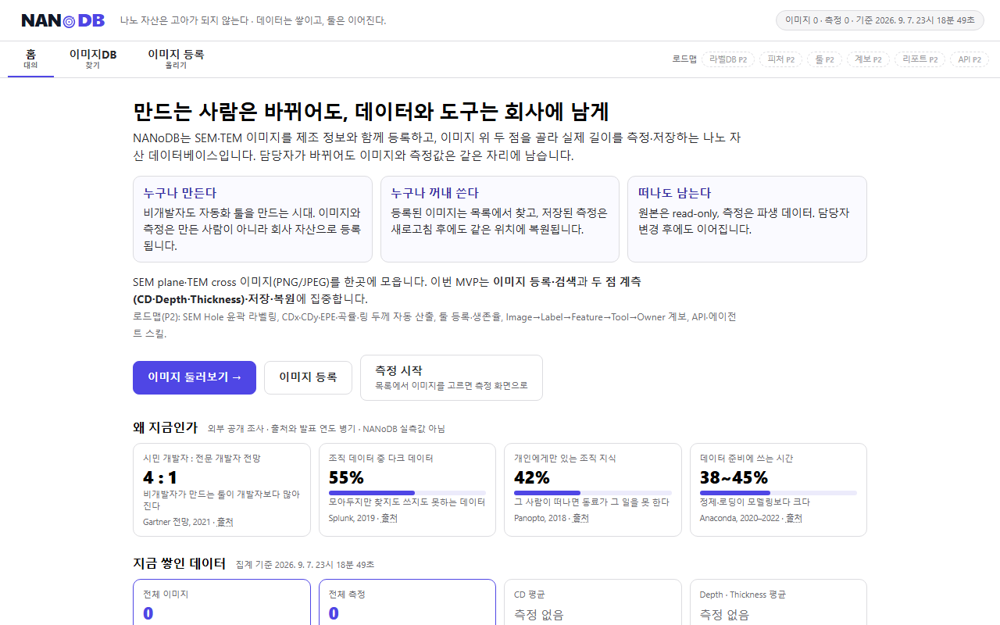
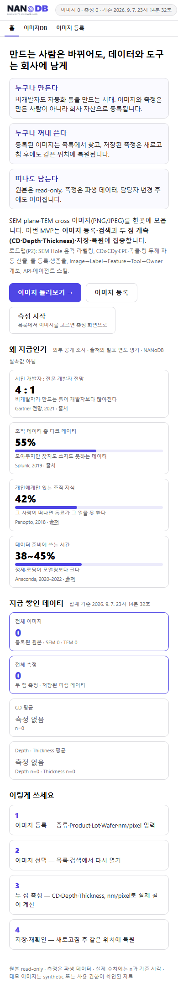

# NANoDB 홈 탭 요구사항

> 기준 자료: `references/NanoDB_홈탭_구성.pdf` · 시안: [`home-tab/home-tab-mockup.html`](home-tab/home-tab-mockup.html) (§7)  
> 적용 원칙: 심사용 메시지와 발표 흐름은 반영하되, 8시간 MVP에서 구현하지 않는 기능을 동작하는 것처럼 표현하지 않는다.

## 1. 목적과 범위

홈은 NANoDB의 첫 화면이자 해커톤 발표의 스크롤 순서다. 사용자는 홈만 보고도 다음 내용을 이해할 수 있어야 한다.

1. 왜 NANoDB가 필요한가
2. 어떤 이미지와 데이터를 다루는가
3. 지금 시연할 수 있는 기능이 무엇인가
4. 실제로 얼마나 데이터가 쌓였는가
5. 어디서부터 사용하면 되는가

PDF가 제시한 전체 제품 온톨로지 `Image → Label → Feature → Tool → Owner`는 제품 방향으로 보존한다. MVP가 실제 구현하는 연결은 `Image → Measurement`이며, Measurement는 원본 이미지에서 파생된 두 점 계측 결과다.

## 2. 용어와 표시 원칙

- **공개 통계**: NANoDB 필요성을 설명하는 외부 조사 수치. 출처명과 발표 연도를 함께 표시한다.
- **실제 KPI**: 현재 SQLite 데이터에서 계산한 이미지·측정 수치. 예시값을 대신 표시하지 않는다.
- **로드맵**: 향후 구현할 Label, Feature, Tool, Owner/Lineage, Report, API 기능. 비활성 상태 또는 `P2` 배지로 표시한다.
- **원본 read-only**: 업로드된 원본은 웹 UI에서 수정하거나 덮어쓰지 않고, 측정은 별도 파생 데이터로 저장한다는 뜻이다.
- 홈에서 `라벨`이라는 말은 윤곽 라벨 기능이 실제 구현되었을 때만 데이터 건수 의미로 사용한다. MVP에서는 `측정`으로 표기한다.

## 3. 기능 요구사항

### 3.1 헤더와 내비게이션

- **HOM-001:** NANoDB 로고를 선택하면 홈(`/`)으로 이동해야 한다.
- **HOM-002 (2026-09-07 개정):** 브랜드 줄 `NANoDB : Nano Assets, Never orphaned Database.`와 부제 `데이터는 쌓이고, 툴은 이어진다`를 데스크톱 헤더 또는 히어로 영역에 표시해야 한다. 한국어 직역(`나노 자산은 고아가 되지 않는다`)은 화면에 표시하지 않는다(구두 설명 전용).
- **HOM-003:** 헤더 상태 영역에는 실제 이미지 수, 실제 측정 수, 집계 기준 시각을 표시해야 한다.
- **HOM-004:** 주 내비게이션은 최소 `홈`, `이미지DB`, `이미지 등록`을 제공하고 현재 위치를 표시해야 한다. 헤더·내비의 모양은 기존 nanodb 앱의 chrome(56px topbar, 로고+부제, pill 내비, `app.css` 토큰)을 그대로 따르고, 홈 탭은 첫 항목으로 추가한다 — 헤더를 새로 디자인하지 않는다.
- **HOM-005:** LabelDB, Feature, Tool, Owner/Lineage, Report, API를 전체 제품 방향으로 노출할 경우, 미구현 항목은 `준비 중` 또는 `P2`로 표시하고 클릭 동작을 제공하지 않아야 한다.
- **HOM-006:** 로그인, 역할 배지와 권한별 메뉴는 표시하지 않아야 한다. 정적인 발표용 역할 문구도 실제 로그인 상태로 오인되지 않게 해야 한다.

### 3.2 본문 순서와 메시지

- **HOM-007:** 본문은 다음 순서를 유지해야 한다. P1 공개 통계를 생략하면 다음 섹션이 그 자리를 당겨 이어진다.
  1. 대의와 제품 한 문장
  2. 세 가지 가치
  3. 처리 대상과 MVP 범위
  4. 핵심 CTA
  5. `왜 지금인가` 공개 통계
  6. 실제 데이터 KPI
  7. 사용 흐름
  8. 데이터 정책
- **HOM-008:** 대표 제목은 `나노 자산은 고아가 되지 않는다`의 뜻을 유지하고, 데이터와 도구가 담당자 변경 후에도 이어진다는 제품 목적을 설명해야 한다.
- **HOM-009:** 세 가지 가치는 `누구나 만든다`, `누구나 꺼내 쓴다`, `떠나도 남는다`로 구성해야 한다.
- **HOM-010:** 범위 문단은 SEM/TEM 이미지를 한곳에 모으고, 이번 MVP는 이미지 등록·검색과 두 점 계측·복원에 집중한다는 점을 명시해야 한다.
- **HOM-011:** PDF의 `SEM Hole 피처 6종 자동 계산`이나 윤곽 라벨링을 현재 기능이라고 서술하지 않아야 한다. 이는 로드맵 문구로만 사용할 수 있다.

### 3.3 CTA

- **HOM-012:** Primary CTA `이미지 둘러보기`는 이미지 목록으로 이동해야 한다.
- **HOM-013:** Secondary CTA `이미지 등록`은 등록 화면으로 이동해야 한다.
- **HOM-014:** 측정 CTA는 대상 이미지가 있어야 수행할 수 있음을 나타내며, 이미지 목록 또는 선택된 이미지의 측정 화면으로 이동해야 한다.
- **HOM-015:** 미구현 `라벨링 시작`, `내 툴 등록`, `API/스킬 호출`은 활성 CTA로 표시하지 않아야 한다.

### 3.4 공개 근거

- **HOM-016 (P1):** `왜 지금인가` 영역은 최대 네 개의 짧은 카드로 제한한다.
- **HOM-017 (P1):** 각 카드에는 수치, 수치가 뜻하는 바, 출처 기관, 발표 연도를 표시해야 한다.
- **HOM-018 (P1):** 외부 통계는 정적 콘텐츠로 제공하며 런타임 외부 API에 의존하지 않아야 한다.
- **HOM-019 (P1):** 오래된 조사 수치를 현재 실측값처럼 표현하지 않아야 하며, 조사 연도를 숨기지 않아야 한다.
- **HOM-020 (P1):** 통계 상세 URL은 새 탭 링크 또는 출처 표기로 제공할 수 있다. 공간이 부족하면 네 개 카드 중 일부를 제거할 수 있다.

### 3.5 실제 KPI

- **HOM-021:** 실제 KPI 영역은 최소 전체 이미지 수와 전체 측정 수를 서버 집계 결과로 표시해야 한다.
- **HOM-022 (P1):** 항목별 측정 카드에는 측정 종류, 평균값, 단위 `nm`, 표본 수 `n`을 표시해야 한다.
- **HOM-023:** KPI 영역 제목 옆에 집계 기준 시각을 표시해야 한다.
- **HOM-024:** 데이터가 없으면 `0`, `n=0` 또는 `측정 없음`을 표시하고 PDF 예시값(예: 1,240, 812, 38.2 nm)을 대입하지 않아야 한다.
- **HOM-025:** 도구 생존율, 라벨 완료율, 검수 건수는 MVP 데이터 모델에서 계산할 수 없으므로 KPI로 표시하지 않아야 한다.

### 3.6 사용 흐름과 정책

- **HOM-026:** 사용 흐름은 `이미지 등록 → 이미지 선택 → 두 점 측정 → 저장·재확인`의 네 단계로 표시해야 한다.
- **HOM-027:** 정책 줄에는 `원본 read-only`, `측정은 파생 데이터`, `실제 수치에는 n·기준 시각`, `데모 이미지는 synthetic 또는 공개 사용 가능 자료`를 표시해야 한다.
- **HOM-028:** 모바일에서는 슬로건과 보조 설명을 숨길 수 있으나, 로고·주 CTA·실제 KPI의 의미는 유지해야 한다. 모바일 전용 최적화는 완료 기준이 아니다.

## 4. 콘텐츠 우선순위

| 우선순위 | 반드시 포함 | 축소 가능 |
| --- | --- | --- |
| P0 | 제목, 세 가치, MVP 범위, 실제 동작 CTA, 이미지/측정 KPI, 4단계 사용 흐름 | 아니요 |
| P1 | 공개 통계 카드와 출처, 항목별 평균, 정책 줄 | 시간 부족 시 카드 수·표현 축소 |
| P2 | 전체 제품 탭, 온톨로지 설명, Tool 생존율, Lineage, Report, API/Skill 안내 | 비활성 로드맵 표기만 허용 |

## 5. 수용 기준

- 첫 진입 시 제목과 이미지 목록 CTA가 1280px 너비에서 스크롤 없이 보인다.
- 홈을 위에서 아래로 스크롤하면 대의 → 근거 → 현재 기능/숫자 → 사용 흐름의 발표 순서가 유지된다.
- 이미지 또는 측정을 추가한 뒤 홈을 다시 열면 실제 KPI와 기준 시각이 갱신된다.
- 빈 데이터베이스에서도 예시 숫자가 실제 KPI로 노출되지 않는다.
- P1 공개 통계를 표시한다면 출처 기관과 발표 연도가 보인다.
- 모든 활성 CTA가 구현된 경로로 이동한다.
- 미구현 기능은 클릭 가능한 탭이나 버튼처럼 보이지 않는다.
- 원본 이미지와 측정 파생 데이터의 구분이 홈의 정책 문구에 드러난다.

## 6. PDF 시안과 MVP의 차이

| PDF 시안 | 8시간 MVP 적용 |
| --- | --- |
| 이미지 수 · 라벨 수 · 갱신 시각 | 이미지 수 · 측정 수 · 집계 기준 시각 |
| 역할 배지 · 로그인 | 제외 |
| SEM Hole 윤곽 라벨링과 검수 | 제외, 두 점 수동 계측으로 대체 |
| CDx · CDy · 대각 CD · EPE · 곡률 · 링 두께 자동 산출 | 제외, CD/Depth/Thickness 수동 계측 유지 |
| 툴 등록 · 생존율 | P2 로드맵 |
| Image → Label → Feature → Tool → Owner 계보 | 제품 방향 설명만 유지, 구현은 Image → Measurement |
| API · 에이전트 스킬 | P2 로드맵, 내부 MVP API만 사용 |
| 1,240 · 812 · 38.2 nm 등 | 예시값이므로 실제 KPI에 사용 금지 |

## 7. 홈 탭 시안 (2026-09-07 추가 · 같은 날 개정: 기존 nanodb chrome 유지)

> 시안 파일: [`home-tab/home-tab-mockup.html`](home-tab/home-tab-mockup.html) — 정적 HTML 한 장, 외부 의존 없음. 브라우저에서 열면 그대로 홈 레이아웃이며, `/api/summary`가 있으면 실제 KPI를 채우고 없으면 빈 상태(`0`, `n=0`, `측정 없음`)를 보여준다.
> 캡처 재생성: `python home-tab/shots.py` (Playwright). 아래 이미지는 이 시안의 캡처이며 데이터 값은 요구사항 HOM-024에 따라 예시가 아닌 **빈 상태** 또는 **"예시 화면" 라벨이 붙은 상태**만 담았다.

### 7.1 캡처

**실제 실행 화면 (기존 nanodb 앱에 Home 탭을 추가한 결과, `home.reference.js`)**



참고 구현: [`home-tab/home.reference.js`](home-tab/home.reference.js) — 기존 `el/panel/stat/grid` 프리미티브만 사용, 헤더 변경은 로고 이미지·부제·Home 항목 추가뿐. KPI는 `/dashboard`·`/images`·`/analysis`(approved만) 호출.

**정적 시안 (MVP용, 같은 chrome 토큰)**

| 상태 | 이미지 | 설명 |
| --- | --- | --- |
| 데스크톱 1280, 데모 후 상태 |  | `?state=demo`. KPI 영역에 `예시 화면` 배지가 붙는다. 실제 앱에는 이 분기가 없다 |
| 데스크톱 1280, 빈 DB |  | 첫 실행·초기화 직후. `0`, `n=0`, `측정 없음` |
| 첫 화면(스크롤 없음) |  | 수용 기준 1: 제목과 `이미지 둘러보기` CTA가 1280×800 안에 보인다 |
| 모바일 390 |  | HOM-028: 슬로건·보조 설명 숨김, 로고·주 CTA·KPI 유지 |

### 7.2 `/api/summary` 응답 계약 (홈이 요구하는 최소 필드)

홈은 아래 필드만 사용한다. `nanodb-mvp-requirements.md` §6의 `GET /api/summary`가 이 형태를 만족해야 한다.

```json
{
  "image_count": 12,
  "measurement_count": 5,
  "images_by_type": { "SEM": 0, "TEM": 12 },
  "by_parameter": [
    { "parameter": "CD",        "mean_nm": 27.4,  "n": 3 },
    { "parameter": "Depth",     "mean_nm": 148.9, "n": 2 },
    { "parameter": "Thickness", "mean_nm": null,  "n": 0 }
  ],
  "as_of": "2026-09-07T16:20:00+09:00"
}
```

- `n = 0`이면 `mean_nm`은 `null`이고 홈은 `측정 없음`을 표시한다 (HOM-024).
- `as_of`는 서버가 집계한 시각(ISO 8601)이며 헤더 상태와 KPI 제목 옆에 같은 값을 쓴다 (HOM-003, HOM-023).
- 요청 실패 시 홈은 빈 상태를 표시하고 오류 텍스트를 KPI 제목 옆에 적는다. 예시값을 대신 넣지 않는다.

### 7.3 시안 ↔ 요구사항 대응

| 시안 영역 | 요구사항 | 구현 메모 |
| --- | --- | --- |
| 헤더 로고 → `/` | HOM-001 | `assets/logo/nanodb_logo_horizontal.png` 그대로, 높이 36px (기존 topbar 56px 안). 파비콘 `assets/logo/nanodb_favicon.svg` |
| 헤더 부제 `데이터는 쌓이고, 툴은 이어진다` · 히어로 브랜드 줄 `NANoDB : Nano Assets, Never orphaned Database.` | HOM-002 | 한국어 직역 없음. 768px 이하 부제 숨김 |
| 헤더 상태 pill `이미지 N · 측정 N · 기준 시각` | HOM-003 | `/api/summary`만 사용 |
| 탭 `홈 · 이미지DB · 이미지 등록` + 힌트 | HOM-004 | 기존 nanodb pill 내비(활성 = 연한 파랑 배경), `aria-current="page"` |
| 로드맵 칩 `라벨DB · 피처 · 툴 · 계보 · 리포트 · API` (P2) | HOM-005 | 점선 테두리 `span`, `aria-disabled`, href 없음. 탭 줄 오른쪽에 두어 탭과 구분 |
| 로그인·역할 없음 | HOM-006 | 헤더 우측에는 상태 pill만 |
| 본문 8순서 | HOM-007 | 대의 → 세 가치 → 범위 → CTA → 공개 통계 → KPI → 사용 흐름 → 정책 |
| h1 `만드는 사람은 바뀌어도, 데이터와 도구는 회사에 남게` | HOM-008 | |
| 세 가치 카드 | HOM-009 | 문구를 MVP 기능(등록·복원·파생 데이터)으로 서술 |
| 범위 문단 + 로드맵 한 줄 | HOM-010, 011 | Hole 피처·라벨링은 `로드맵(P2)` 접두어로만 언급 |
| CTA 3개 → `/images`, `/images/new`, `/images`(측정은 이미지 선택 후) | HOM-012~015 | 라우트 이름은 구현 시 확정. 미구현 CTA 없음 |
| 공개 통계 4카드: 수치 · 뜻 · 출처 · 연도 · 링크 | HOM-016~020 | 정적 콘텐츠. 카드 순서: Gartner 2021, Splunk 2019, Panopto 2018, Anaconda 2020–2022 |
| KPI 4카드: 전체 이미지(종류별) · 전체 측정 · CD 평균(n) · Depth/Thickness 평균(n) | HOM-021~025 | 생존율·완료율·검수 없음 |
| 사용 흐름 4단계 | HOM-026 | 등록 → 선택 → 두 점 측정 → 저장·재확인 |
| 정책 줄 | HOM-027 | 4항목 그대로 |

### 7.4 스타일 토큰

| 토큰 | 값 | 용도 |
| --- | --- | --- |
| `--accent` | `#1d5fb4` (기존 `app.css`) | 활성 탭 배경, primary CTA, KPI 강조, 통계 막대 |
| `--ink` / `--ink-soft` / `--ink-faint` | `#16202c` / `#5a6b7d` / `#8a99a8` (기존 `app.css`) | 제목·본문 / 보조 / 힌트 |
| `--line` / `--panel-2` / `--bg` | `#dde3ea` / `#fafbfc` / `#f4f6f9` (기존 `app.css`) | 카드 테두리 / 칩 배경 / 페이지 배경 |
| 폰트 | Pretendard → Segoe UI → Noto Sans KR → Malgun Gothic, `tabular-nums` | 숫자 자리폭 고정 |
| 폭 | 본문 `max-width: 980px`, 문단 `780px` | 1280 시연 화면 기준 |
| 카드 | `border 1px`, `radius 10px`, hover 시 테두리 `--blue` | 그림자 없음 |

### 7.5 구현 시 주의

- 홈 HTML에는 h1·세 가치·정책 문구가 JS 없이도 존재해야 한다(정적 골격). KPI만 JS로 채운다.
- 로드맵 칩은 `<a>`나 `<button>`으로 만들지 않는다. 클릭 가능한 것처럼 보이면 HOM-005 위반.
- 공개 통계 카드의 링크는 `target="_blank" rel="noopener"`.
- 시안의 `?state=demo` 분기는 캡처 전용이며 앱 코드에 옮기지 않는다.

### 7.6 2026-09-07 개정 — 근거 통계 교체, 차트, Phase 로드맵

**공개 통계 카드 (HOM-016~020 적용, 4장 고정)**

| 수치 | 뜻 | 출처 · 연도 |
| --- | --- | --- |
| 80% | 로우코드 툴 사용자 중 IT 부서 밖 개발자 (2026 전망) — 툴을 만드는 사람은 이미 현업 엔지니어 | Gartner, 2022 |
| 78% | 저장된 기업 데이터 중 비정형(이미지·문서). 5.5 ZB(2024) → 10.5 ZB(2028) | IDC StorageSphere, 2024 |
| 68% | 기업이 확보하고도 쓰지 못하는 데이터 | Seagate · IDC Rethink Data, 2020 |
| 38% | 데이터 준비(정제·로딩)에 쓰는 시간 | Anaconda, 2022 |

Gartner 2021(4:1)·Splunk 2019·Panopto 2018은 더 최신 조사로 교체했다. 연도는 항상 함께 표시한다.

**실데이터 차트 (승인값만, 기존 `charts.js` 재사용)** — 가장 측정이 많은 파라미터의 히스토그램(spec 선 포함)과 Lot별 박스플롯, 이미지 종류·측정 상태 구성 막대, 일별 등록 추이. 데이터가 없으면 차트 대신 `No values to plot.`을 표시한다. 상자·막대를 누르면 분석 화면으로 내려간다.

**한 줄로 물어보기** — `승인된 [파라미터] 값을 [Lot별] 나눠서 분포로 보여줘 → 분포 보기` 위젯. 분석 화면의 필터로 이동만 하며 새 계산은 하지 않는다.

**Phase 로드맵 (HOM-005·011 준수: Phase 1만 "지금 동작", 나머지는 로드맵 배지)**

| Phase | 한 단어 | 내용 |
| --- | --- | --- |
| 1 | 모은다 | SEM·TEM 이미지를 제조 정보·캘리브레이션과 함께 등록하고, annotation 측정값을 원본까지 역추적되게 축적한다 |
| 2 | 표준화한다 | 구조 파라미터 마스터 통일, SEM Hole 윤곽 라벨 축적, CDx·CDy·대각 CD·EPE·곡률·링 두께 자동 산출, 제품·Lot별 산포 비교 |
| 3 | 이어준다 | 측정 recipe를 툴로 등록(입출력 계약·담당자·실행 이력), Image → Label → Feature → Tool → Owner 계보, API·에이전트 스킬 |
| 4 | 제안한다 | 비숙련 엔지니어가 이미지를 올리면 축적된 이미지·라벨·측정을 근거로 주요 측정 feature를 제안한다. 엔지니어는 어떤 feature를 추출할지 배우고, 승인 결과가 다시 인프라에 쌓인다 |

본문 순서(HOM-007)에서 Phase 로드맵은 `실제 데이터 KPI`와 `사용 흐름` 사이에 둔다.
